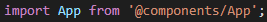

# React and webpack boilerplate

This is a simple template for starting a React app with webpack bundler.

## Table of contents

- [Setup](#setup)
- [Webpack Config](#webpack-config)
- [Babel JS](#babel-js)
- [ESLint and Prettier](#eslint-and-prettier)
- [Folders structure and Routing](#folders-structure-and-routing)

## Setup

To start a React application using this template just:

1. Clone it.
2. Change the project name and data in the [package.json](package.json)
3. Set the title for your app in [public/index.html](public/index.html)
4. Install dependencies by running `npm install`
5. Remove the hidden `.git` file in the root directory and run `git init` to initialize your new repository

## Webpack config

This is divided in 3 files by using _webpack-merge_:

There is the [webpack.config.base.js](webpack.config.base.js) file, in which you will find the main settings that are the same both for development mode, and for production.

Also, there is the [webpack.config.dev.js](webpack.config.dev.js) file, that adds some settings for the dev server. It's for development mode and you can run the server with this config by doing **npm start**. By default it is using the port 3006, but you can change that in this file, if you want to.

Finally, you have the [webpack.config.prod.js](webpack.config.prod.js) file, that adds some optimizations for production mode. To use this config, you should run **npm run build**. This will create a `dist` folder (short for distribution) in the root directory, and inside the bundle of the project. Open the created `index.html` file to check it out!

## Babel JS

Babel comes already installed and with a basic [.babelrc](.babelrc) config file. This will allow you to use all Javascript latest features by compiling the code and transforming it into a new code understandable by any browser.

## ESLint and Prettier

Regarding the formatting of the code, the repository comes with ESLint, Prettier, and all the necessary plugins and configurations needed to use both of them without any issues. 

To personalize the formatting options, you can add rules to the [.eslintrc](.eslintrc) file. If you do not know how to do this, check [this documentation](https://eslint.org/docs/user-guide/configuring/rules#configuring-rules). Additionally, you can check the existing rules [here](https://eslint.org/docs/rules/). You can check if there is something in your app that is not in compliant with your rules, by running:

```
npm run lint
```

Or if you want ESLint to try to automatically adjust your issues when possible, run:

```
npm run lint:fix
```

By the other hand, you can add rules to the [.prettierrc](.prettierrc) file. It already comes with some basic options, but [here](https://prettier.io/docs/en/options.html) is a document that can help you check and apply the best configuration for you. To format your code applying these rules automatically, you can run:

```
npm run format
```

## Folders structure and Routing

The project comes with a basic structure implemented, but you will probably need to add more folders as the complexity of your app increases. From the root directory, you can find:

  - A `dist` folder, in which the project will be built.
  - A `public` folder, with the index.html file that has a main div, in which your entire app will be injected on.
  - A `src` folder. This is where you will add most of your project. <br /> 
  Inside you have an `assets` folder that includes another one for the images. Here you will probably add new ones like "icons" or "videos", depending on your app requirements. <br />
  Additionally, you have a `components` folder, with your main component `App.jsx`, that is already being rendered from the index file. Here you can add all your components, dividing them based on app modules, using atomic design or whatever structure you want to implement.

Finally, thanks to webpack, this project counts with routing to import your files. These are just shortcuts to avoid having different relative paths spread throughout the project. If you take a look at the [webpack.config.base.js](webpack.config.base.js) file, on the `resolve` property, you will find some aliases defined for the _@components_ and the _@images_ folders. You can add aliases here and use them when importing a file as shown below:


